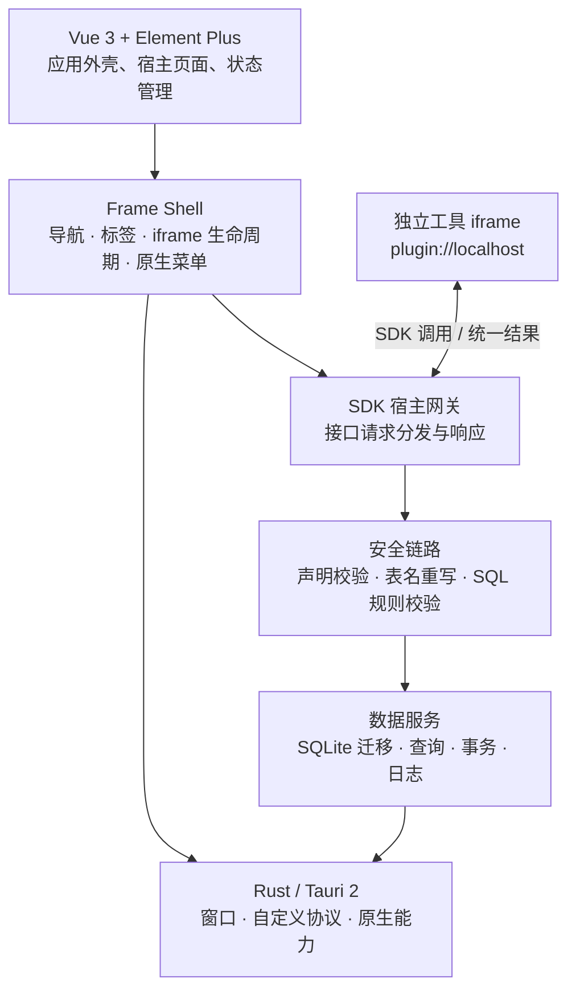

# Treasure

> 一个以本地优先为核心、可承载多种效率工具的桌面应用平台。

[](https://v2.tauri.app)
[](https://vuejs.org/)
[](https://www.typescriptlang.org/)
[](LICENSE)

**Treasure** 最初源于一个很朴素的愿望：做一款自己真正愿意长期使用的 Markdown 笔记程序。随着 JSON 格式化、时间戳转换等网页小工具在日常工作中不断出现，一个更有价值的方向逐渐清晰——与其在浏览器标签页之间切换，不如把这些小而实用的能力收纳到同一个可靠、原生、可扩展的桌面空间中。

Treasure 因此从单一应用的设想，演进为一个面向效率工具的桌面宿主平台：它负责统一的工作区、数据与安全边界、菜单与标签体验，以及插件运行时；具体工具能力则以独立插件的形式接入。

## 目录

- [产品定位](#产品定位)
- [产品原型与核心流程](#产品原型与核心流程)
- [技术架构](#技术架构)
- [数据与安全边界](#数据与安全边界)
- [设计语言与颜色方案](#设计语言与颜色方案)
- [项目结构](#项目结构)
- [快速开始](#快速开始)
- [开发与构建](#开发与构建)
- [项目生态](#项目生态)
- [文档与许可证](#文档与许可证)

## 产品定位

Treasure 是一个**本地优先的桌面工具容器**，而不是某一类工具本身。它将不同用途的工具统一收纳到一致的应用外壳中，让用户在一个桌面工作区内完成打开、切换、配置与管理。

| 面向对象 | 提供的价值 |
| --- | --- |
| 用户 | 在统一界面中使用与管理常用小工具，减少网页工具分散、反复搜索与数据离散。 |
| 工具创作者 | 通过标准 SDK 接入宿主提供的存储、文件、菜单、设置和通信能力。 |
| 平台维护者 | 在宿主侧集中管理插件元数据、权限边界、数据隔离、审计与桌面体验。 |

### 设计原则

- **本地优先**：应用元数据、设置与工具数据基于本地 SQLite 保存；不以在线服务为前提。
- **统一而不过度统一**：外壳提供稳定的导航、标签和管理体验；工具本身保留独立的交互空间。
- **渐进式扩展**：新增能力优先以插件接入，不将每个工具都耦合进宿主主工程。
- **安全隔离**：插件运行在 iframe 中，经由消息桥接访问受控能力；不同插件的数据表具有命名空间隔离。
- **桌面原生感**：以 Tauri 承接窗口、原生菜单、文件对话框、通知、日志与 macOS 窗口行为。

## 产品原型与核心流程

### 应用结构

```text
┌─────────────────────────────────────────────────────────────┐
│ 原生菜单栏（macOS）                                           │
├───────────────┬─────────────────────────────────────────────┤
│ 品牌区         │ 标签栏：已打开的工具，可切换、关闭、保活       │
│ 侧边导航       ├─────────────────────────────────────────────┤
│ · 工具菜单     │ 内容区：欢迎页 / 插件管理 / 设置 / 工具 iframe │
│ · 插件管理     │                                             │
│ · 系统设置     │                                             │
└───────────────┴─────────────────────────────────────────────┘
```

| 区域 | 作用 |
| --- | --- |
| 侧边导航 | 由本地菜单数据动态构建，提供工具入口、插件管理与系统设置入口；支持折叠。 |
| 标签栏 | 管理已打开的页面与工具。宿主页面通过 `keep-alive` 保持状态，插件页通过 `v-show` 保持 iframe 实例。 |
| 内容区 | 承载欢迎页、插件管理、系统设置等宿主页面；工具页面以独立 iframe 显示。 |
| 原生菜单 | 根据当前活动工具注册的菜单项重建，并与系统默认菜单协同工作。 |

### 一次启动会发生什么

1. Vue 应用挂载 Element Plus、Pinia 与 Vue Router。
2. 宿主初始化 SDK 宿主网关，并启动 SQLite 数据库迁移。
3. 数据库就绪后，读取菜单、插件与设置数据，构建侧边导航。
4. 用户打开工具时，宿主创建标签；工具页面由 `plugin://localhost/<pluginCode>/index.html` 加载。
5. 工具通过 SDK 提供的接口调用宿主能力；宿主负责校验、执行并返回统一结果。

### 宿主能力范围

- **工具目录管理**：查看、配置、隐藏、删除与调试接入的工具。
- **统一配置**：维护平台与工具的设置项；开发模式开关决定是否展示调试工具。
- **标签与窗口体验**：管理打开状态、活动标签、页面缓存、macOS 窗口拖动区与原生菜单。
- **本地存储服务**：提供迁移、查询、写入、事务、日志等基础能力。
- **受控系统能力**：通过 Tauri 插件提供文件读写、文件选择、通知、日志和外部打开等能力。

> 本仓库聚焦 Treasure 宿主应用。工具的业务页面、SDK API 细节与工具源码分别维护在独立仓库，见[项目生态](#项目生态)。

## 技术架构



### 前端

- **Vue 3 + TypeScript**：负责宿主 UI、页面组织与类型化业务逻辑。
- **Vite**：提供开发服务器与生产构建；`@` 指向 `src`。
- **Element Plus**：承载基础组件与图标体系。
- **Pinia**：维护菜单、标签和工具菜单注册等共享状态。
- **Vue Router**：管理欢迎页、插件管理、设置与 `/plugin/:pluginCode` 路由；插件路由由应用外壳实际渲染。

### 桌面与原生层

- **Tauri 2 / Rust**：构建跨平台桌面应用，并承接窗口、菜单、文件与通知等原生能力。
- **macOS 窗口适配**：采用 Overlay 标题栏与隐藏标题，配合原生红黄绿窗口按钮的显隐控制。
- **自定义插件协议**：`plugin://localhost` 负责向 iframe 提供已安装工具的静态资源。
- **应用打包**：Tauri bundler 生成平台安装包；macOS 使用 `icons/icon.icns` 作为应用图标资源。

### 数据层

- **SQLite + rusqlite**：数据库连接与关键操作由 Rust 层托管。
- **可靠性设置**：启用 WAL、外键约束与忙等待；查询、写入和事务均有统一入口。
- **版本化迁移**：启动时自动创建或升级平台表结构，并记录迁移历史。
- **平台数据**：插件、菜单、设置、迁移记录、初始化记录与日志等均由平台表维护。

## 数据与安全边界

工具页面不直接获得宿主数据库权限。它们通过 SDK 提供的接口调用宿主能力，宿主针对每一次 SQL 请求执行以下链路：

```text
来源校验
  → Rust SQL 解析与声明表比对
  → 裸表名重写为 plugin_{pluginCode}_ 前缀
  → SQL 操作、平台表与表前缀规则校验
  → SQLite 执行与标准响应回传
```

关键约束如下：

- 每个工具只能访问属于自身命名空间的 `plugin_{pluginCode}_*` 数据表。
- `tp_*`、`sys_*` 等平台表不可由工具直接操作。
- 禁止高风险 DDL，如 `DROP TABLE`、`ALTER TABLE`、`RENAME TABLE`；仅允许受控的 `CREATE TABLE`。
- 支持参数化查询与多语句事务；事务中的每条 SQL 都会分别校验。
- 文件、对话框等系统能力也通过 SDK 接口调用，由宿主网关执行受控转发，而非直接暴露给 iframe。

## 设计语言与颜色方案

Treasure 采用“**暖调毛玻璃文人雅致**”设计语言：温暖的米色内容基底、深紫色导航、暖金色品牌点缀，共同构成「宣纸上的紫墨」气质。以下规范仅定义 Treasure 宿主应用的界面语言。

### 色彩角色

| 角色 | 色值 | 使用位置 |
| --- | --- | --- |
| 内容基底 | `#F5EFE4` | 主内容区、空白区域与暖米色界面基调 |
| 标签表面 | `#ECE3D3` | 顶部标签栏与浅色功能区 |
| 导航深紫 | `#3D3450` | 左侧导航与深色结构区域 |
| 导航文字 | `#C9B8D9` | 深色导航中的常规文字与图标 |
| 交互紫 | `#7656A7` | 活动文本、强调状态 |
| 亮紫 | `#B69CFF` | 导航激活边线与高亮点缀 |
| 暖金 | `#E8C98A` | 品牌、装饰与有限强调 |
| 危险语义 | `#D36C6C` | 删除、错误与高风险操作 |

### 使用规则

- 大面积区域保持暖米色与深紫色的稳定关系；暖金仅作为品牌和细节点缀。
- 阴影使用暖棕色透明度，不使用冷灰或纯黑阴影。
- 分隔线使用低对比度暖棕透明色，避免切割感过强。
- 品牌区使用草写字标与金紫渐变；正文、表单和菜单保持清晰易读的系统字体。
- 功能色只表达状态，不替代主视觉层级。

### Treasure 宿主界面规范

- **应用骨架**：左侧为深紫导航，中上部为标签栏，内容区使用暖米色表面；不在宿主外壳中使用纯白大面积背景。
- **导航状态**：常规文字使用 `#C9B8D9`，悬停与选中使用低透明度紫色表面，选中项以 `#B69CFF` 左侧细线标识。
- **品牌区**：`DiamondIcon` 作为小型金色标记，搭配 Pinyon Script 草写字标；文字采用浅金、琥珀金、古铜金到淡紫的渐变，仅用于 Treasure 品牌名。
- **标签与内容**：标签栏使用 `#ECE3D3`，活动标签文字使用 `#7656A7`；内容层级优先通过留白、暖棕阴影和低对比度边界组织。
- **组件状态**：紫色用于主要交互与选中，暖金用于品牌和次级强调，`#D36C6C` 仅用于删除、错误等危险语义。

## 项目结构

```text
.
├── src/
│   ├── bridge/                 # iframe 消息桥、SQL 重写与安全校验
│   ├── components/
│   │   ├── frame/              # 应用外壳：导航、标签、iframe 与原生菜单
│   │   ├── pluginManager/      # 工具目录管理
│   │   └── setting/            # 平台设置
│   ├── sql/                    # 前端数据服务与迁移就绪门禁
│   ├── store/                  # Pinia：菜单、标签、菜单注册中心
│   ├── style/common.css        # 全局设计令牌与 Element Plus 主题覆盖
│   └── main.ts                 # 前端入口：挂载与初始化
├── src-tauri/
│   ├── src/db.rs               # SQLite、迁移、事务与 Tauri commands
│   ├── src/lib.rs              # 自定义协议、SQL 解析校验与原生命令
│   └── tauri.conf.json         # 窗口、构建与资源协议配置
├── SDK-HOST.md                 # 宿主桥接协议参考
├── SDK-PLUGIN.md               # 工具接入协议参考
└── package.json
```

## 快速开始

### 环境要求

- Node.js 18+（建议使用当前 LTS）
- npm（本项目使用 `package-lock.json`）
- Rust stable 与目标平台所需的 Tauri 系统依赖

关于系统依赖与环境安装，请参阅 [Tauri v2 前置条件](https://v2.tauri.app/start/prerequisites/)。

### 安装与启动

```bash
git clone https://github.com/Luzenrocy/treasure.git
cd treasure
npm install
npm run tauri -- dev
```

开发态 Vite 地址固定为 `http://localhost:1420`，HMR WebSocket 端口为 `1421`。如需局域网调试，可设置 `TAURI_DEV_HOST`。

## 开发与构建

| 命令 | 说明 |
| --- | --- |
| `npm run dev` | 仅启动 Vite 前端开发服务器。 |
| `npm run tauri -- dev` | 启动 Tauri 桌面开发应用。 |
| `npm run build` | 执行 Vue 类型检查并构建前端资源。 |
| `npm run tauri -- build` | 先构建前端，再产出当前平台的桌面安装包。 |

### 开发约定

- 新增宿主数据结构时，将迁移逻辑集中在 Rust 数据库层，并确保已有数据可升级。
- 所有宿主数据访问应等待数据库迁移完成，不绕过 `sql/common.ts` 的就绪门禁。
- 新增桥接 action 时，应同时考虑来源校验、参数校验、权限范围与标准响应。
- 平台界面应复用 `src/style/common.css` 与本文的宿主界面规范，避免新增无来源的颜色。
- 本仓库不包含 lint 或 test npm 脚本；提交前至少执行 `npm run build`。

## 项目生态

Treasure 由三个独立仓库构成，各自保持清晰职责：

| 仓库 | 职责 |
| --- | --- |
| [Luzenrocy/treasure](https://github.com/Luzenrocy/treasure) | 本仓库。桌面宿主、UI 外壳、本地数据服务、桥接层与平台管理功能。 |
| [Luzenrocy/treasure-sdk](https://github.com/Luzenrocy/treasure-sdk) | 工具接入 SDK 与开发约定。 |
| [Luzenrocy/treasure-plugins](https://github.com/Luzenrocy/treasure-plugins) | 独立工具源码与发布内容。 |

## 文档与许可证

- [Tauri v2 文档](https://v2.tauri.app)
- [宿主桥接协议](SDK-HOST.md)
- [工具接入协议](SDK-PLUGIN.md)
- [Apache License 2.0](LICENSE)

欢迎通过 Issue 或 Pull Request 参与讨论与改进。在提交前，请说明改动是否影响宿主 UI、数据迁移、桥接协议或安全边界。
